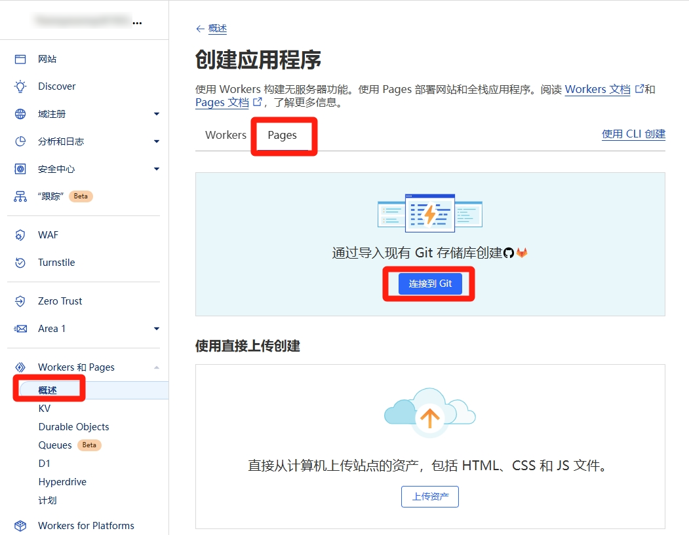
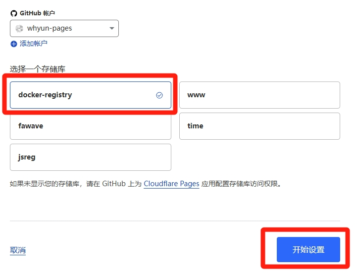
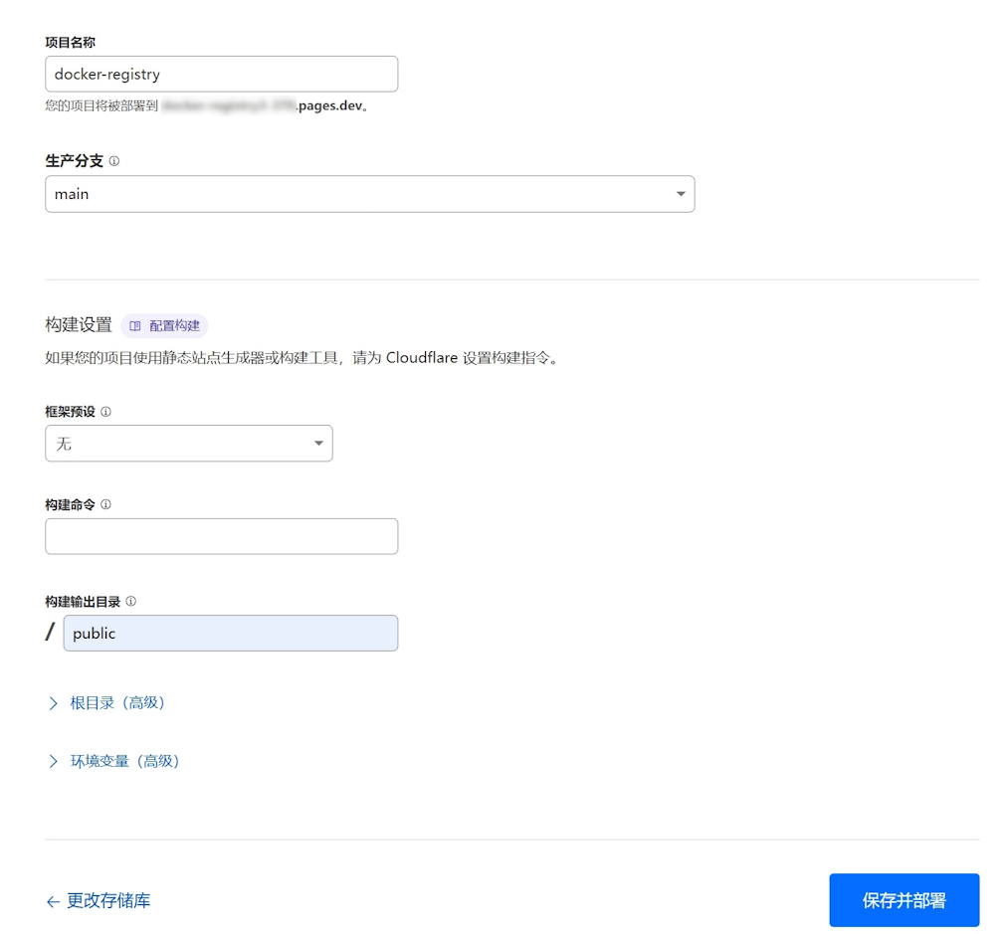
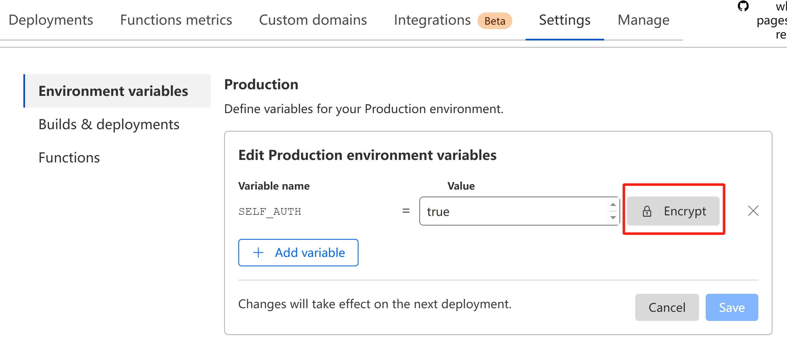

# docker-registry
使用 cloudflare pages 来加速访问 dockerhub 镜像。

## 快速部署
请将本项目仓库 fork 到自己的 github 仓库，然后在 cloudflare pages 中新建项目来使用。
1.使用 cloudflare 账号登录其 dashboard 后台，选择 **Workers 和 Pages** 菜单，然后点击 **概述**，接着点击 **创建** 按钮，在打开的页面中选择 Pages 选项卡：


**图1**

选择 git 模式进行部署。

2.选择你 clone 好的项目，点击 **开始设置** 按钮：



**图2**

3.除了项目名字和输出目录之外，所有配置项都使用默认值即可，点击 **保存并部署** 按钮：



**图3**

4.经过短暂时间的等待，如果你看到如下界面，恭喜你部署成功：


**图4**

5.点击 **继续处理项目按钮**，在展示的页面中点击 **访问站点** 链接，即可验证站点的部署情况，不过默认需要等几分钟才能打开网站。


**图5**

6.网站可访问后展示效果：


**图6**

更多详细使用教程参见 [cloudflare page 教程（一）项目初始化](https://blog.whyun.com/posts/project-init-on-cloudflare-pages/) 。

## 配置
### 登录配置

当前项目部署完成后，必须使用 docker login 命令进行登录，才能正常使用。否则进行 docker pull 镜像的时候，会如下报错：
```
Error response from daemon: Head "https://你的部署域名/v2/library/镜像名/manifests/latest": unauthorized: Unauthorized
```

同时需要注意，docker login 默认会登录 docker hub 镜像站，但是我们的自己搭建的 Pages 网站使用的域名和 docker.io 不是一个域名，所以需要在调用 docker login 命令时追加 Pages 网站部署域名，即 `docker login 你的部署域名`。

例如你的镜像站域名是 `docker-registry-xxx.pages.dev` ，那么需要保证调用 `docker login docker-registry-xxx.pages.dev` 是成功的。
### 权限配置
可以通过配置若干环境变量，来对镜像代理的行为做控制。

> 以下用到的环境变量，通过 cloudflare dashboard 的面板进行设置。
> 

#### WHITE_LIST
镜像站允许的用户列表，多个用户之间用英文逗号分隔，默认为空。`WHITE_LIST` 生效后，在拉取任何镜像时，你需要确保 `docker login` (或者 `podman login`) 命令之前已经调用成功，否则后端读取不到登录用户，会直接报错，不会再拉取镜像。


